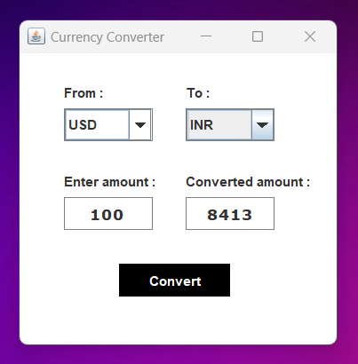

# Currency Converter

## Screenshot

## Description

A currency converter application built in Java, capable of converting between multiple currencies.

## Installation

1. Clone the repository: `git clone https://github.com/yourusername/currency-converter.git`
2. Navigate to the project directory: `cd currency-converter`
3. Compile the project: `javac CurrencyConverter.java`
4. Run the application: `java CurrencyConverter`

## Usage

- Enter the amount and select the currencies to convert between.
